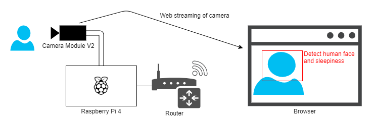

# RaspiWebStreaming-DetectSleepiness
Web streaming and detection human sleepiness in a raspberry pi camera.

# Overview
* Web streaming of cameras connected to Raspberry Pi.
* Detect human face and sleepiness.



# Requirement
## Devices
* Raspberry Pi 4
* Camera Module V2 For raspberry pi

## Packages
* python3
* flask
* opencv
* dlib
* imutils
* scipy
* greenlet

# Installation
```bash
pip3 install flask opencv-python dlib imutils scipy greenlet
```
# Usage
Run application
```bash
python3 src/main.py
```

Open URL
```bash
http://localhost:5000
```

# License
"RaspiWebStreaming-DetectSleepiness" is under [MIT license](https://en.wikipedia.org/wiki/MIT_License).